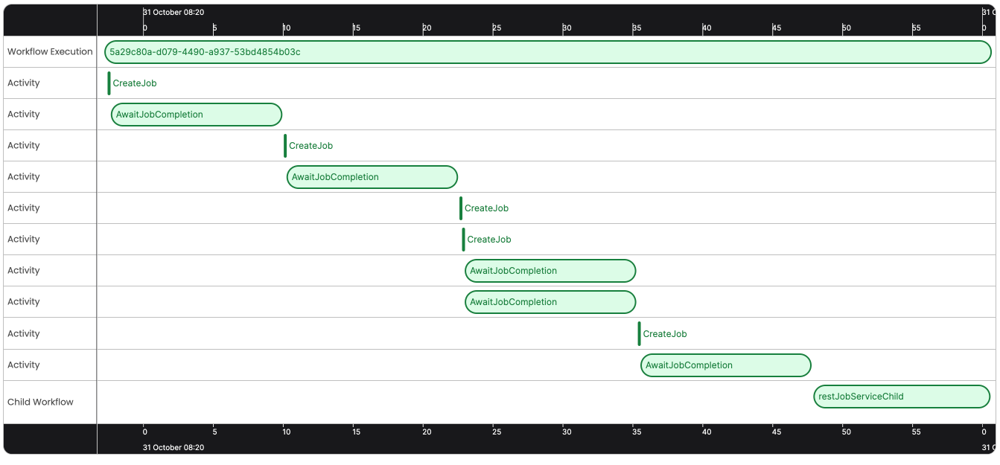
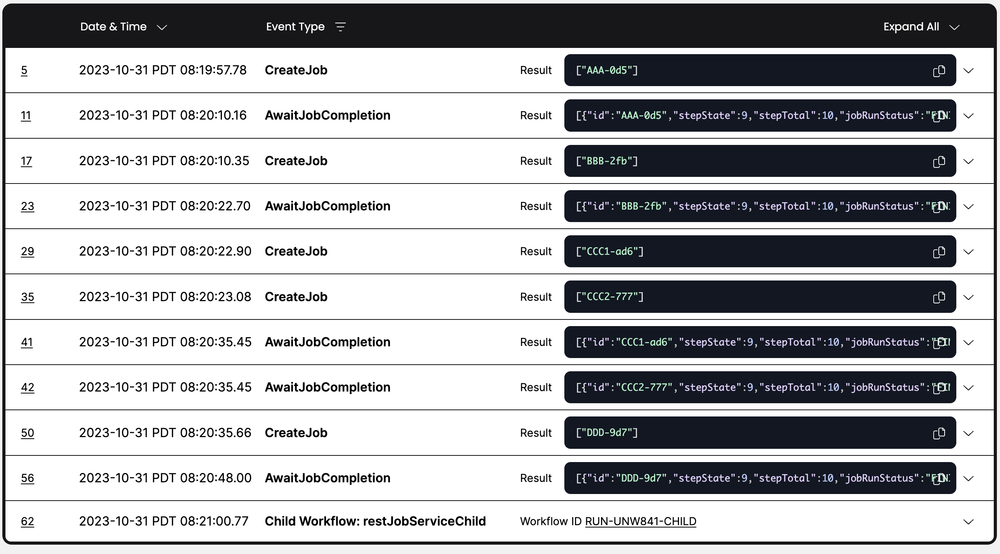

# Temporal REST Job Service

The primary purpose of this sample is to demonstrate the ability of  [Temporal](https://temporal.io) to integrate with legacy orchestration systems.


_Temporal Timeline view of legacy system job execution_

---


_Temporal Event history view of legacy system job execution_

## Running the Sample
Full instructions below, but here's a summary of the steps to run the demo:
1. Start the legacy Job Service Orchestrator Server
2. Start a Temporal Worker
3. Start a Temporal Workflow


## Legacy Workflow Orchestrator

#### Run the legacy Job Service Orchestrator Server
You will need to run the RESTful job server so your Temporal workflow can interact with it.
```bash
./gradlew -q execute -PmainClass=com.example.job.service.web.WebServer
```

**Debug View of Job System**
Navigate to `http://localhost:7070/`
Submitting the form will return an ID you can use: `http://localhost:7070/job/<ID>`

## Temporal

### Configuration

The sample is configured by default to connect to a [local Temporal Server](https://docs.temporal.io/cli#starting-the-temporal-server) running on localhost:7233.

To instead connect to Temporal Cloud, set the following environment variables, replacing them with your own Temporal Cloud credentials:

```bash
TEMPORAL_ADDRESS=testnamespace.sdvdw.tmprl.cloud:7233
TEMPORAL_NAMESPACE=testnamespace.sdvdw
TEMPORAL_CERT_PATH="/path/to/file.pem"
TEMPORAL_KEY_PATH="/path/to/file.key"
````

(optional) set a task queue name
```bash
export TEMPORAL_REST_JOB_SERVICE_TASKQUEUE="RestJobService"
```

### Run a Workflow
```bash
./gradlew -q execute -PmainClass=io.temporal.samples.restjobservice.RestJobServiceRequester --console=plain
```

### Run a worker
```bash
./gradlew -q execute -PmainClass=io.temporal.samples.restjobservice.RestJobServiceWorker --console=plain
```

Note: Use a Java 18 SDK.
